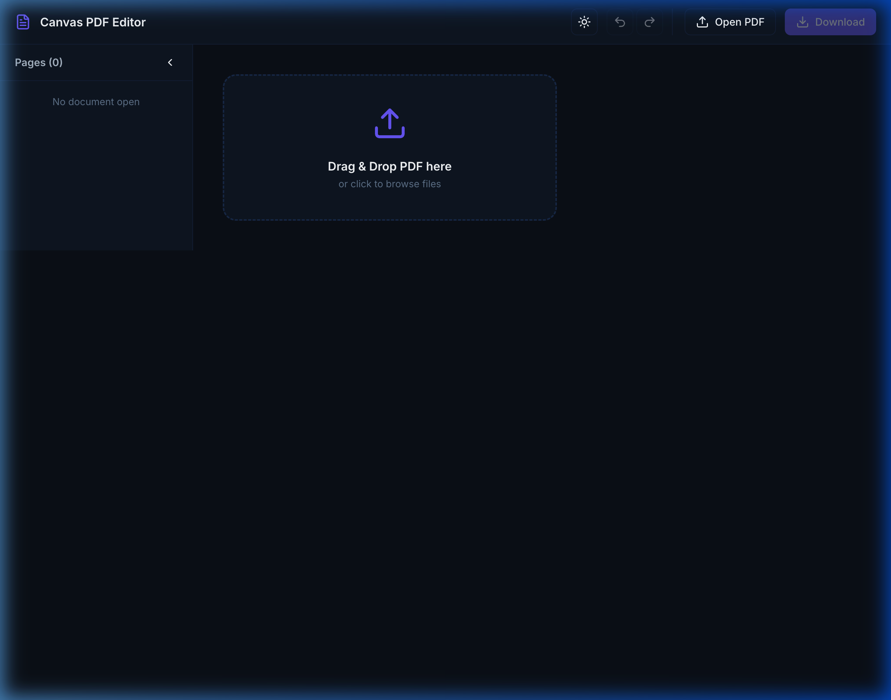
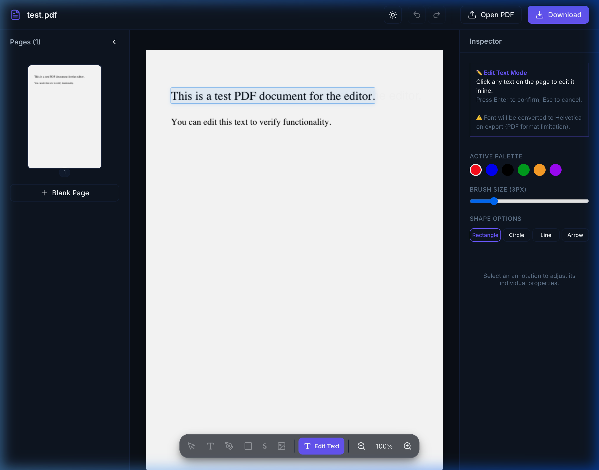
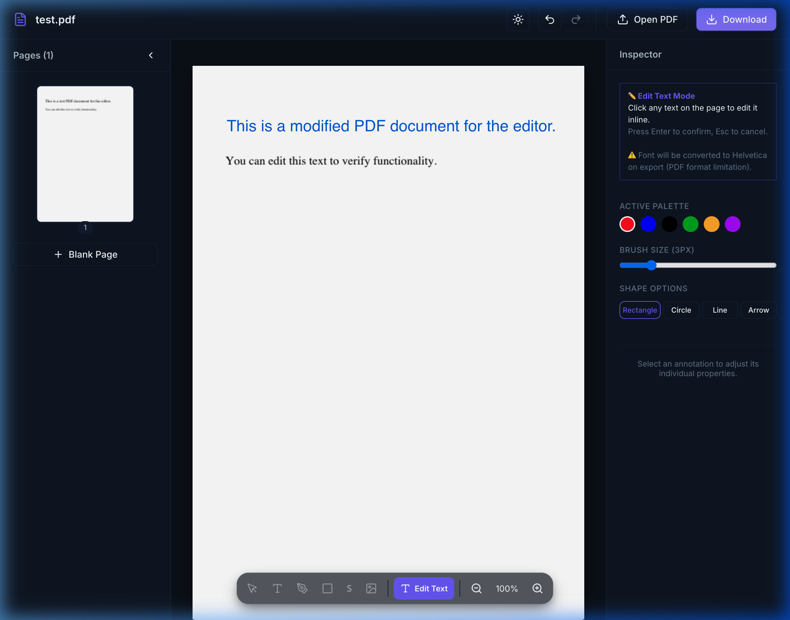

# PDF Editor

A powerful, in-browser PDF editing tool built with React, TypeScript, and Vite. This application allows users to edit PDF text in-place, offering a true WYSIWYG experience without requiring a backend server.



## Features
- **In-Place Text Editing:** Click on any text in the PDF to edit it directly on the canvas.
- **Deep Redaction:** Uses MuPDF via WebAssembly to completely remove the old text from the binary structure, ensuring it cannot be recovered.
- **Advanced Text Layout:** Implements Knuth-Plass line breaking algorithms to ensure beautiful text wrapping when modifying paragraphs.
- **AST Reflow:** Automatically parses the PDF Abstract Syntax Tree (AST) to push surrounding elements down when text expands.
- **Offline / Client-Side Only:** All processing is done in the browser. No server required.

## Demo

Here is a full demonstration of the editor in action:


## Functionality

**1. Upload & Edit Text**
Click on any text layer to activate the inline editing mode.



**2. Save & Compile**
The application uses MuPDF to completely redact the old text and PDF-lib to typeset the new changes before downloading the final file.



## Technical Architecture

The project employs a dual-engine architecture:
- **MuPDF (WASM):** Handles the physical redaction of original text blocks.
- **PDF-lib:** Handles assembling the new document and typesetting the new text.
- **PDF.js:** Used for frontend rendering and normalized coordinate extraction.

For a deeper dive into the technical implementation, please read the [Architecture Skill](.gemini/skills/pdf-editor-architecture/SKILL.md) document.

## Quick Start

### Installation

Clone the repository and install the dependencies:

```bash
npm install
```

### Running Locally

Start the Vite development server:

```bash
npm run dev
```

Navigate to `http://localhost:5173/` in your browser.

### Building for Production

Compile TypeScript and build the application:

```bash
npm run build
```

The compiled assets will be placed in the `dist/` directory.

## License
MIT
